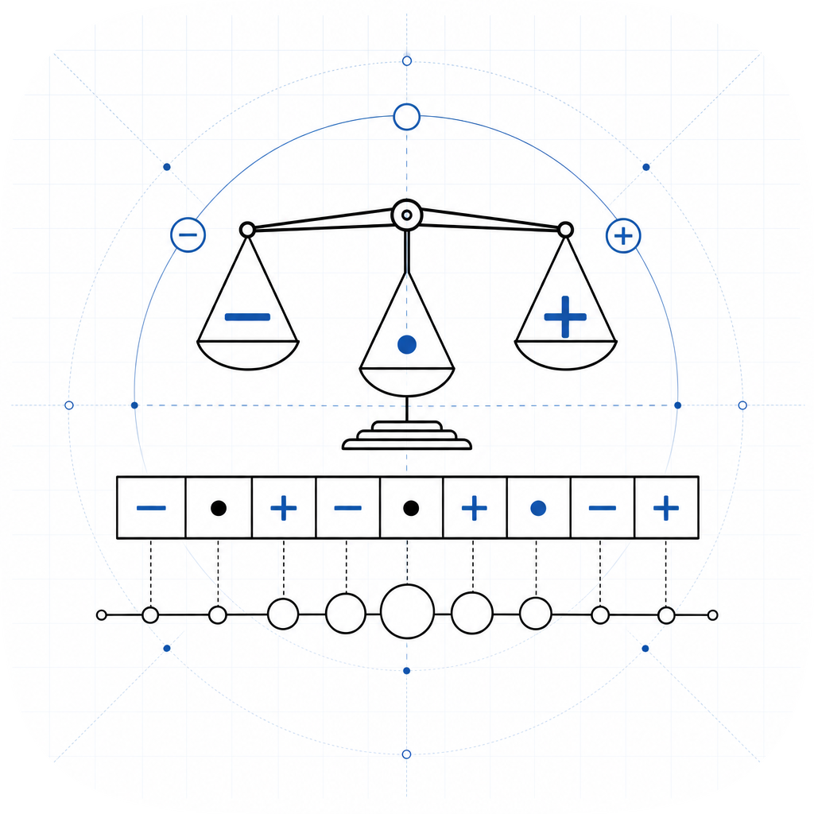

# balanced-ternary

<p align="center">
  
</p>

A pure-Python implementation of balanced ternary arithmetic. The `BalancedTernary`
type uses digits from the set {-1, 0, 1}, writes -1 as `T` in T-notation, and
implements addition and multiplication at the digit level with balanced-ternary
carry logic -- not by converting to int and back.

## What is balanced ternary?

Balanced ternary is a non-standard positional numeral system where each digit
(trit) is one of {-1, 0, 1}. The value -1 is conventionally written as `T`.
The value of a balanced ternary numeral is the sum of each digit times its
corresponding power of 3.

```
"1TT" = 1*9 + (-1)*3 + (-1)*1 = 9 - 3 - 1 = 5
"T1T" = (-1)*9 + 1*3 + (-1)*1 = -9 + 3 - 1 = -7
"1T"  = 1*3 + (-1)*1 = 3 - 1 = 2
```

Every integer has a unique balanced ternary representation, and negation is
exact -- just flip the sign of every digit.

## Installation

```
pip install balanced-ternary
```

Or with uv:

```
uv add balanced-ternary
```

## Quick start

```python
from balanced_ternary import BalancedTernary

# Convert from int
a = BalancedTernary.from_int(5)
print(a.to_str())  # "1TT"

# Convert from T-notation string
b = BalancedTernary.from_str("1T")
print(b.to_int())  # 2

# Arithmetic (digit-level carry logic)
print((a + b).to_int())   # 7
print((a - b).to_int())   # 3
print((a * b).to_int())   # 10

# Negation is exact -- just flip digit signs
print((-a).to_str())      # "T11"  (-5 in balanced ternary)

# T-notation input supports lowercase t
c = BalancedTernary.from_str("1t0T")
print(c.to_int())  # 23

# Ordering: compare and sort by integer value
x = BalancedTernary.from_int(3)
y = BalancedTernary.from_int(7)
print(x < y)   # True
print(x >= y)  # False
values = [BalancedTernary.from_int(n) for n in [5, -2, 0, 3]]
print([v.to_int() for v in sorted(values)])  # [-2, 0, 3, 5]

# Floored division and modulo (Python semantics: remainder has sign of divisor)
d = BalancedTernary.from_int(7)
e = BalancedTernary.from_int(2)
print((d // e).to_int())   # 3
print((d % e).to_int())    # 1
q, r = divmod(d, e)
print(q.to_int(), r.to_int())  # 3 1

# Negative divisor: remainder is non-positive (Python floored convention)
f = BalancedTernary.from_int(-2)
print((d // f).to_int())   # -4
print((d % f).to_int())    # -1
```

## API

### `BalancedTernary.from_int(value: int) -> BalancedTernary`

Convert any Python int to balanced ternary.

### `BalancedTernary.from_str(text: str) -> BalancedTernary`

Parse a T-notation string. Valid characters are `0`, `1`, `T`, `t`. The
string is most-significant-first. Raises `ValueError` on empty input or
invalid characters.

### `to_int() -> int`

Return the integer value.

### `to_str() -> str`

Return the canonical T-notation string (most-significant-first, no leading
zeros except for the value zero itself).

### Operators

| Operator | Meaning                         |
|----------|---------------------------------|
| `+`      | Addition                        |
| `-`      | Subtraction                     |
| `*`      | Multiplication                  |
| `//`     | Floored integer division        |
| `%`      | Floored modulo (remainder sign matches divisor) |
| `divmod()` | Returns `(quotient, remainder)` as `BalancedTernary` values |
| unary `-`| Negation (exact, no carry needed) |
| `==`     | Equality                        |
| `<`, `<=`, `>`, `>=` | Ordering by integer value (sortable) |
| `hash()` | Hashable (usable as dict key)   |
| `repr()` | `BalancedTernary.from_str('...')` |
| `str()`  | T-notation string               |

**Division sign convention:** `//` and `%` follow Python's floored division: the
remainder always has the same sign as the divisor. For example, `(-7) // 2 == -4`
and `(-7) % 2 == 1`. `__truediv__` (`/`) is intentionally omitted -- `BalancedTernary`
is an exact integer type and true division would break the exact-arithmetic contract
for most operand pairs.

## Digit-level carry logic

When adding two balanced-ternary digits plus a carry, the column sum `s` is
mapped as follows:

| s  | result digit | carry out |
|----|--------------|-----------|
| -3 | 0            | -1        |
| -2 | 1            | -1        |
| -1 | -1           | 0         |
| 0  | 0            | 0         |
| 1  | 1            | 0         |
| 2  | -1           | 1         |
| 3  | 0            | 1         |

Multiplication uses digit-by-digit partial products accumulated with the
addition logic above.

## Development

```
git clone https://github.com/amaar-mc/balanced-ternary
cd balanced-ternary
uv pip install -e ".[dev]"
uv run pytest -q
uv run ruff check .
uv run mypy src
```

## License

MIT. See [LICENSE](LICENSE).
